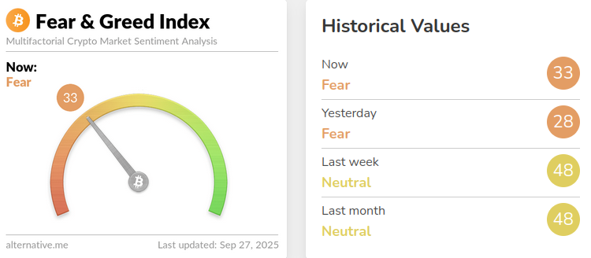

THE PROBLEM:

People often lose money on crypto, because they follow the crypto Fear & Greed Index:

F&G assumes that Fear is an undervalued market and buying opportunity, while Greed means crypto market is a bubble. The message is clear and easy to follow, the only problem is that it is often wrong.

Not every crash is a buying opportunity and not every raise is a bubble. But F&G can't tell that, because it's based on crypto price, Google searches, and social media hype - and doesn't take into account real economy indicators, like inflation and stock market. That is why F&G is so unreliable and people lose so big.

THE SOLUTION:

To help people make better decisions, I built an interactive dashboard that finds if F&G long-term is stable and then squares F&G with real economy indicators: S&P 500 Index (stock market value) and inflation rate.

The dashboard shows in real time if F&G is justified or not.

For example:

- If Fear goes along stock market crash and inflation is high, buying is a mistake. But if stock market is rising and inflation is low, Fear is indeed a buying opportunity. Buy now!
- If Greed goes along rising stock market and inflation is low, it's safe to buy. But if stock market is falling and inflation is high, Greed is a bubble. Time to sell!

THE INSIGHTS:

|    Crypto Sentiment   | S&P 500 Index  | Inflation |  Insight    |
|-----------------------|----------------|-----------|-------------|
| 🟩 Fear  (low price)  | 📈  Rising    | 📉  Low   | Buy now!    |
| 🟥 Fear  (low price)  | 📉  Falling   | 📈  High  | Don't buy!  |
| 🟩 Greed (high price) | 📈  Rising    | 📉  Low   | Safe to buy |
| 🟥 Greed (high price) | 📉  Falling   | 📈  High  | Sell now!   |

THE DATA:

|         Data                  |       Purpose       |      Source        |     Extraction method                     | URL / code
|-------------------------------|---------------------|--------------------|-------------------------------------------|------|
| Crypto "Fear & Greed Index"   | Crypto sentiment    | www.alternative.me | requests.get(url)                         | https://api.alternative.me/fng/
| S&P 500 Index                 | Economy indicator   | YahooFinance       | yfinance library  | yfinance.Ticker("^GSPC")|
| Monthly inflation rate        | Economy indicator   | World Bank         | requests.get(url)                         | https://api.stlouisfed.org/fred/series/observations?series_id=CPIAUCSL&api_key={}&file_type=json |

THE LOGIC:
1) Crypto "Fear & Greed Index" is obtained directly.
   
2) S&P 500 Index is obtained directly from Yahoo Finance.
   
3) Monthly inflation rate is not obtained directly. Instead, I get Consumer Price Index (CPI) for each month.

Then I calculate Monthly inflation rate by the formula:
- Monthyl Inflation rate = ((Current month CPI / Previous month CPI) - 1) * 100

Then, I annualize Monthly Inflation rate by the formula:
- Annualized inflation = ((1 + Monthly Inflation rate / 100) ** 12 - 1) * 100

To find if Annualized inflation is "High", "Moderate", or "Low", I compare it to the Central Bank target annual inflation, which is 2%:
- if Annulized inflation <= 2%, inflation is "Low".
- if Annulized inflation <= 5%, inflation is "Moderate".
- if Annualized inflation > 5%, inflation is "High".

THE TOOLS:
1) Python & Pandas: API integration and data transformation.
2) Docker & PostgreSQL: data storage.
3) Streamlit: interactive dashboard.

THE CONCLUSION:
This real-time pipeline collects data via APIs, analyses it, and shows the user if the crypto Fear & Greed Index is stable and justified by real economy indicators, and therefore, whether it should be acted upon or not.

IMPORTANT NOTE:
Data on Consumer Price Index (CPI) is provided by Federal Reserve Bank of St.Louis. A personalized API key is required for authentication.
###Instruction on obtaining an API key:
- Register on https://fredaccount.stlouisfed.org/.
- Visit https://fredaccount.stlouisfed.org/apikeys and click on "Request API Key".
- You will recieve your API key on your email.

###Instructions on setup:
- Create .env file in the project root.
- infl_api_key = 'PutYourKeyHere'
